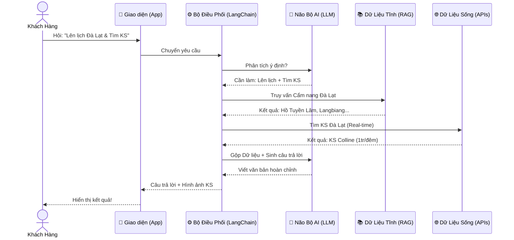

## 🎯 Tính năng

### 🗺️ 1. Gợi ý điểm đến thông minh
- Gợi ý địa điểm du lịch dựa trên **ngân sách, thời gian và sở thích** của người dùng
- Phân tích ngữ cảnh và xử lý sự mơ hồ trong câu hỏi bằng **LLM**
- Trích xuất thực thể (Entity Extraction): địa điểm, thời gian, ngân sách, số người

### 📖 2. Tra cứu thông tin địa điểm
- Thông tin chi tiết về các điểm đến du lịch nổi tiếng Việt Nam
- Danh sách điểm tham quan, món ăn đặc sản, khách sạn theo từng phân khúc
- Thời điểm đẹp nhất để đi du lịch theo từng vùng miền
- Phương tiện di chuyển và chi phí tham khảo

### 🧠 3. Trả lời chính xác bằng RAG (Retrieval-Augmented Generation)
- Kết hợp **Vector Database** với **LLM** để chống ảo giác
- Chỉ trả lời dựa trên dữ liệu đã được kiểm duyệt
- Trích dẫn nguồn tham khảo cho mỗi câu trả lời
- Có thể mở rộng tìm kiếm qua **API tìm kiếm** khi dữ liệu nội bộ không đủ

### 💬 4. Hội thoại đa luồng (Multi-turn Conversation)
- Hỏi lại thông tin khi người dùng cung cấp thiếu dữ liệu
- Duy trì ngữ cảnh xuyên suốt cuộc hội thoại
- Lưu lịch sử hội thoại để tra cứu sau

### 📋 5. Lên lịch trình tự động
- Tự động sinh lịch trình chi tiết theo ngày
- Tối ưu hoá dựa trên ngân sách và sở thích cá nhân

### 💰 6. Tính tiền nhóm
- Quản lý chi phí chuyến đi cho nhóm bạn
- Tính toán chia tiền theo nhiều phương thức
- Báo cáo tổng hợp chi tiết thanh toán

### 💾 7. Lưu & quản lý kế hoạch
- Lưu kế hoạch du lịch đã thông qua
- Xem, sửa, xoá kế hoạch đã lưu
- Xuất và chia sẻ kế hoạch với bạn bè

## Kiến trúc (Sơ đồ Kiến trúc Hệ thống)

### Chú thích các cụm từ:

- **Bộ Điều Phối (LangChain):** Người quản lý phân chia công việc.
- **Não Bộ AI (LLM):** Người suy nghĩ, phân tích ngôn ngữ và viết câu chữ.
- **Dữ Liệu Tĩnh (RAG):** Kho tài liệu công ty (Không thay đổi thường xuyên như chính sách, FAQ, cẩm nang).
- **Dữ Liệu Sống (APIs):** Các cổng kết nối với bên thứ 3 (Amadeus, Google) để lấy giá cả, thời tiết cập nhật theo từng giây. Dữ liệu này phải luôn được cập nhật.

## Yêu cầu môi trường
## Cách cài đặt
## Cách chạy frontend
## Cách chạy backend
## Biến môi trường
